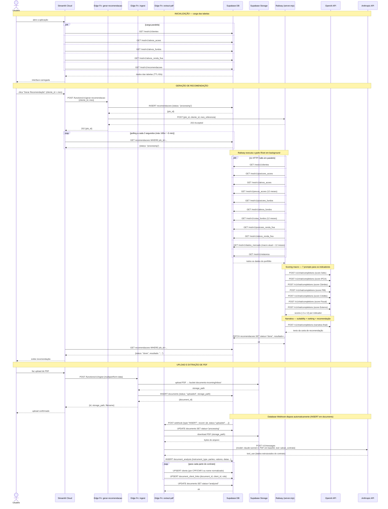
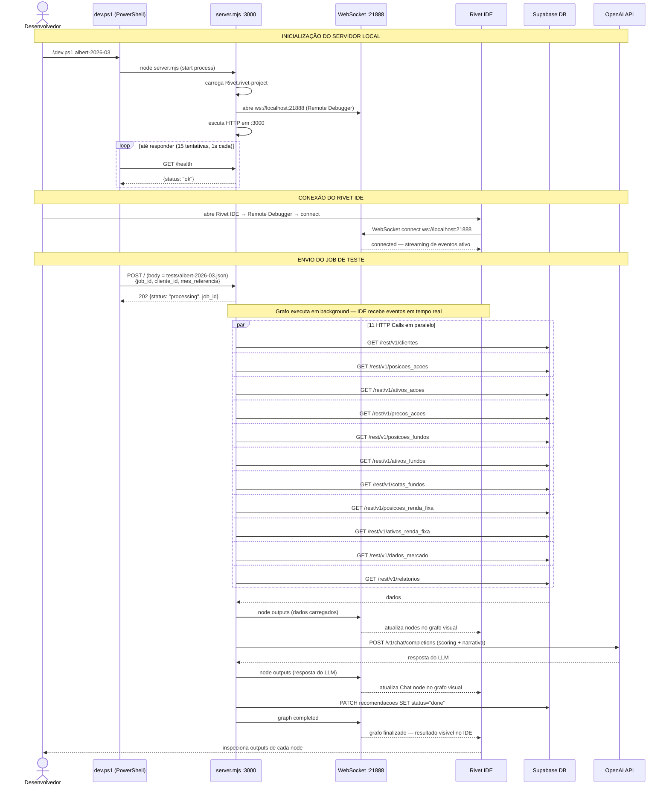

# Arquitetura do Sistema

Documentação completa de todos os servidores, conexões e protocolos do projeto Enter.
Inclui ambiente de produção e ambiente local de desenvolvimento.

---

## Servidores

| Servidor | Tecnologia | Onde roda |
|----------|-----------|-----------|
| **Streamlit** | Python | Streamlit Cloud |
| **Supabase DB** | PostgreSQL | Supabase Cloud (`kiwptwgbfywlgzkznmvz`) |
| **Edge Function: gerar-recomendacao** | Deno/TypeScript | Supabase Cloud |
| **Edge Function: ingest** | Deno/TypeScript | Supabase Cloud |
| **Edge Function: extract-pdf** | Deno/TypeScript | Supabase Cloud |
| **Railway** | Node.js (`server.mjs`) | Railway Cloud |
| **OpenAI** | API externa | OpenAI Cloud |
| **Anthropic** | API externa | Anthropic Cloud |
| **server.mjs local** | Node.js | PC local — porta 3000 |
| **Rivet IDE** | Electron app | PC local |

---

## Diagrama de produção

```
┌──────────────────────────────────────────────────────────────────┐
│                       STREAMLIT CLOUD                            │
│                                                                  │
│  1. load_table()              ── HTTPS REST GET ──────────────► │
│  2. gerar_recomendacao()      ── HTTPS POST ───────────────────► │
│  3. polling recomendacoes     ── HTTPS GET (a cada 3s) ────────► │
│  4. upload PDF                ── HTTPS POST multipart ─────────► │
└──────────────────────────────────┬───────────────────────────────┘
                                   │
                                   ▼
┌──────────────────────────────────────────────────────────────────┐
│                        SUPABASE CLOUD                            │
│                                                                  │
│  ┌────────────────────────────────────────────────────────┐     │
│  │  PostgreSQL DB                                         │     │
│  │                                                        │     │
│  │  clientes, ativos_*, posicoes_*, recomendacoes         │     │
│  │  dados_mercado, relatorios, precos_*, cotas_*          │     │
│  │  documents, document_analysis, document_client_links   │     │
│  │                                                        │     │
│  │  DATABASE WEBHOOK ────────────────────────────────────►│──┐  │
│  │  (INSERT em documents → dispara extract-pdf)           │  │  │
│  └────────────────────────────────────────────────────────┘  │  │
│                                                               │  │
│  ┌──────────────────┐  ┌─────────────────┐  ┌─────────────┐ │  │
│  │ gerar-recomendac │  │ ingest          │  │ extract-pdf │◄┘  │
│  │                  │  │                 │  │             │     │
│  │ recebe:          │  │ recebe:         │  │ recebe:     │     │
│  │ {cliente_id,mes} │  │ PDF (form-data) │  │ - webhook   │     │
│  │                  │  │                 │  │ - chamada   │     │
│  │ 1. INSERT job    │  │ 1. upload para  │  │   direta    │     │
│  │ 2. POST Railway  │  │    Storage      │  │             │     │
│  │ 3. retorna job_id│  │ 2. INSERT em    │  │ 1. download │     │
│  └──────────────────┘  │    documents    │  │    PDF do   │     │
│          │              └─────────────────┘  │    Storage  │     │
│          │                      │             │ 2. POST    ─────►│──► ANTHROPIC
│          │              ┌───────▼───────────┐ │    API      │     │
│          │              │ Storage           │◄│ 3. INSERT  │     │
│          │              │ documents-incoming│ │    analysis│     │
│          │              └───────────────────┘ └─────────────┘     │
└──────────┼───────────────────────────────────────────────────────┘
           │ HTTPS POST (RIVET_SERVER_URL)
           ▼
┌──────────────────────────────────────────────────────────────────┐
│                        RAILWAY CLOUD                             │
│                        server.mjs                                │
│                                                                  │
│  recebe: { job_id, cliente_id, mes_referencia }                  │
│  responde 202 imediatamente                                      │
│  em background:                                                  │
│    1. runGraph("gerar_recomendacao")                             │
│       → 11 HTTP Calls para Supabase REST API                     │
│       → Chat nodes para OpenAI API                               │
│    2. PATCH recomendacoes SET status="done", resultado=...       │
│                                                                  │
└──────────┬────────────────────────────────────┬─────────────────┘
           │ HTTPS GET /rest/v1/*               │ HTTPS POST
           ▼                                    ▼
    SUPABASE (PostgREST)                   OPENAI API
    (busca dados do portfólio)             (gpt-4o-mini)
```

---

## Diagrama de desenvolvimento local

```
┌─────────────────────────────────────────────────────────────────┐
│  PC LOCAL                                                       │
│                                                                 │
│  ┌─────────────┐   HTTP POST :3000    ┌─────────────────────┐  │
│  │  dev.ps1    │────────────────────► │  server.mjs         │  │
│  │ (PowerShell)│                      │  porta 3000         │  │
│  └─────────────┘                      │                     │  │
│                                       │  porta 21888        │  │
│  ┌─────────────┐   WebSocket          │  (Remote Debugger)  │  │
│  │  Rivet IDE  │◄───────────────────► │                     │  │
│  │  (Electron) │  ws://localhost:21888 └─────────────────────┘  │
│  └─────────────┘                             │         │        │
│                                              │         │        │
└──────────────────────────────────────────────┼─────────┼────────┘
                                               │         │
                          HTTPS GET/PATCH      │         │ HTTPS POST
                          (mesmo que Railway)  │         │ chat completions
                                               ▼         ▼
                                        SUPABASE      OPENAI API
                                        (PostgREST)
```

Em desenvolvimento, o `dev.ps1` envia o job diretamente para `http://localhost:3000`, pulando Streamlit e Edge Function. O Rivet IDE conecta via WebSocket e exibe cada node sendo executado em tempo real.

---

## Todas as conexões

| # | De | Para | Protocolo | Trigger |
|---|----|----|-----------|---------|
| 1 | Streamlit | Supabase PostgREST | HTTPS REST GET | leitura de tabelas |
| 2 | Streamlit | Edge Function `gerar-recomendacao` | HTTPS POST | botão "Gerar recomendação" |
| 3 | Streamlit | Supabase `recomendacoes` | HTTPS GET | polling a cada 3s, até 5 min |
| 4 | Streamlit | Edge Function `ingest` | HTTPS POST multipart | upload de PDF |
| 5 | Edge Function `gerar-recomendacao` | Supabase DB | interno Supabase | INSERT job em `recomendacoes` |
| 6 | Edge Function `gerar-recomendacao` | Railway | HTTPS POST | após INSERT do job |
| 7 | Edge Function `ingest` | Supabase Storage | interno Supabase | upload do PDF para bucket |
| 8 | Edge Function `ingest` | Supabase DB | interno Supabase | INSERT em `documents` |
| 9 | **Database Webhook** | Edge Function `extract-pdf` | HTTPS POST | INSERT em `documents` (automático) |
| 10 | Edge Function `extract-pdf` | Supabase Storage | interno Supabase | download do PDF |
| 11 | Edge Function `extract-pdf` | Anthropic API | HTTPS POST | envia PDF em base64 para Claude |
| 12 | Edge Function `extract-pdf` | Supabase DB | interno Supabase | INSERT em `document_analysis` |
| 13 | Railway | Supabase PostgREST | HTTPS GET | Rivet busca dados (11 HTTP Calls) |
| 14 | Railway | OpenAI API | HTTPS POST | Rivet chat nodes (`gpt-4o-mini`) |
| 15 | Railway | Supabase `recomendacoes` | HTTPS PATCH | salva resultado ao finalizar |
| 16 | dev.ps1 | server.mjs local `:3000` | HTTP POST | teste manual de job |
| 17 | Rivet IDE | server.mjs local `:21888` | **WebSocket** | debug em tempo real (só local) |
| 18 | server.mjs local | Supabase PostgREST | HTTPS GET | idem Railway (conexão #13) |
| 19 | server.mjs local | OpenAI API | HTTPS POST | idem Railway (conexão #14) |

---

## Fluxo completo de uma recomendação (produção)

```
Streamlit          gerar-recomendacao     Railway           Supabase DB
    │                      │                  │                  │
    │── POST {cliente,mes} ►│                  │                  │
    │                      │── INSERT job ───────────────────────►│
    │                      │◄──────────────── job_id ────────────│
    │                      │── POST {job_id} ►│                  │
    │◄── { job_id } ───────│                  │                  │
    │                      │                  │── GET ativos ────►│
    │                      │                  │── GET posicoes ──►│
    │                      │                  │── GET macro ─────►│
    │                      │                  │── GET relatorio ─►│
    │                      │                  │   (11 calls)      │
    │                      │                  │── POST OpenAI     │
    │                      │                  │◄── resposta LLM   │
    │                      │                  │── PATCH done ────►│
    │                      │                  │                  │
    │── GET recomendacoes (polling 3s) ──────────────────────────►│
    │◄── status: processing ─────────────────────────────────────│
    │── GET recomendacoes ───────────────────────────────────────►│
    │◄── status: done, resultado ─────────────────────────────────│
```

---

## Fluxo de extração de PDF (produção)

```
Streamlit        ingest          Supabase DB+Storage    extract-pdf      Anthropic
    │               │                    │                    │               │
    │─ POST PDF ───►│                    │                    │               │
    │               │── upload Storage ─►│                    │               │
    │               │── INSERT document ►│                    │               │
    │◄── { id } ───│                    │                    │               │
    │               │                    │── Webhook POST ───►│               │
    │               │                    │                    │─ download PDF ►│ (Storage)
    │               │                    │                    │─ POST PDF ────────────────►│
    │               │                    │                    │◄── análise JSON ───────────│
    │               │                    │◄── INSERT analysis ┤               │
    │               │                    │◄── UPDATE status   │               │
```

---

## O único WebSocket

`ws://localhost:21888` — Remote Debugger do Rivet IDE.

Existe **apenas em desenvolvimento local** (`NODE_ENV !== "production"`). O Rivet IDE conecta nesse socket e recebe em tempo real o estado de cada node do grafo: inputs, outputs e erros. Em produção no Railway esse socket não é aberto.

---

## Autenticação por servidor

| Conexão | Credencial usada |
|---------|-----------------|
| Streamlit → Supabase | `SUPABASE_KEY` (anon key) nos secrets do Streamlit |
| Streamlit → Edge Functions | mesma anon key no header `Authorization` e `apikey` |
| Edge Functions → Supabase | `SUPABASE_SERVICE_ROLE_KEY` (acesso total, sem RLS) |
| Edge Function → Railway | `RIVET_SERVER_URL` (URL com token embutido, variável de ambiente) |
| Railway → Supabase | `SUPABASE_SERVICE_ROLE_KEY` (variável de ambiente no Railway) |
| Railway → OpenAI | `OPENAI_API_KEY` (variável de ambiente no Railway) |
| extract-pdf → Anthropic | `ANTHROPIC_API_KEY` (variável de ambiente no Supabase) |
| server.mjs local → Supabase | `SUPABASE_SERVICE_ROLE_KEY` (arquivo `.env` local) |
| server.mjs local → OpenAI | `OPENAI_API_KEY` (arquivo `.env` local) |

---

## Diagrama de Sequência Completo

### Produção — todos os fluxos



---

### Desenvolvimento local — debug com Rivet IDE


